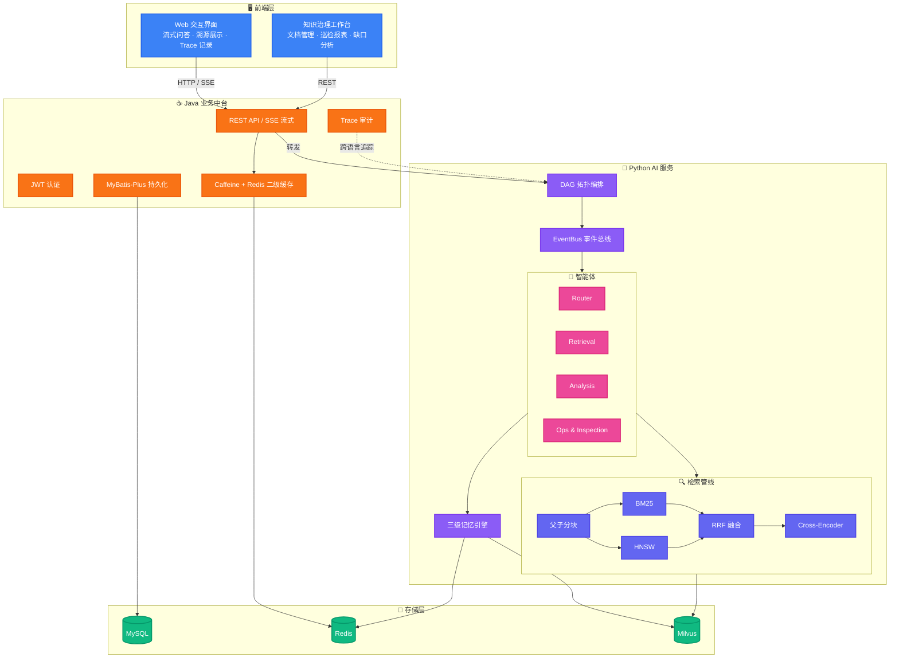
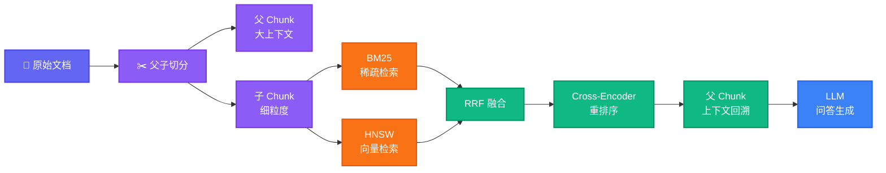
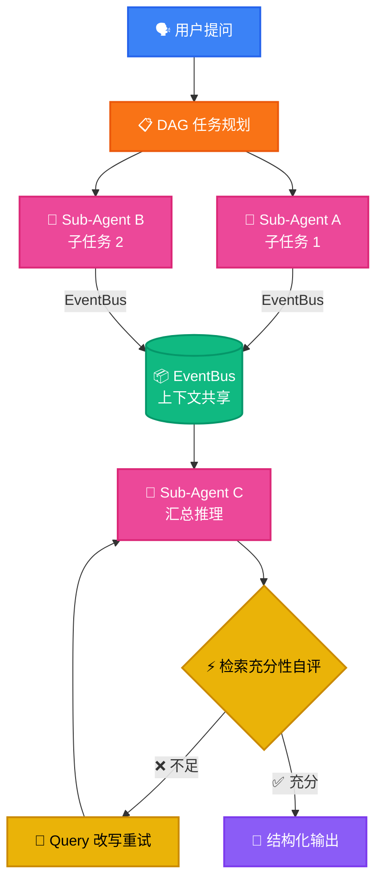
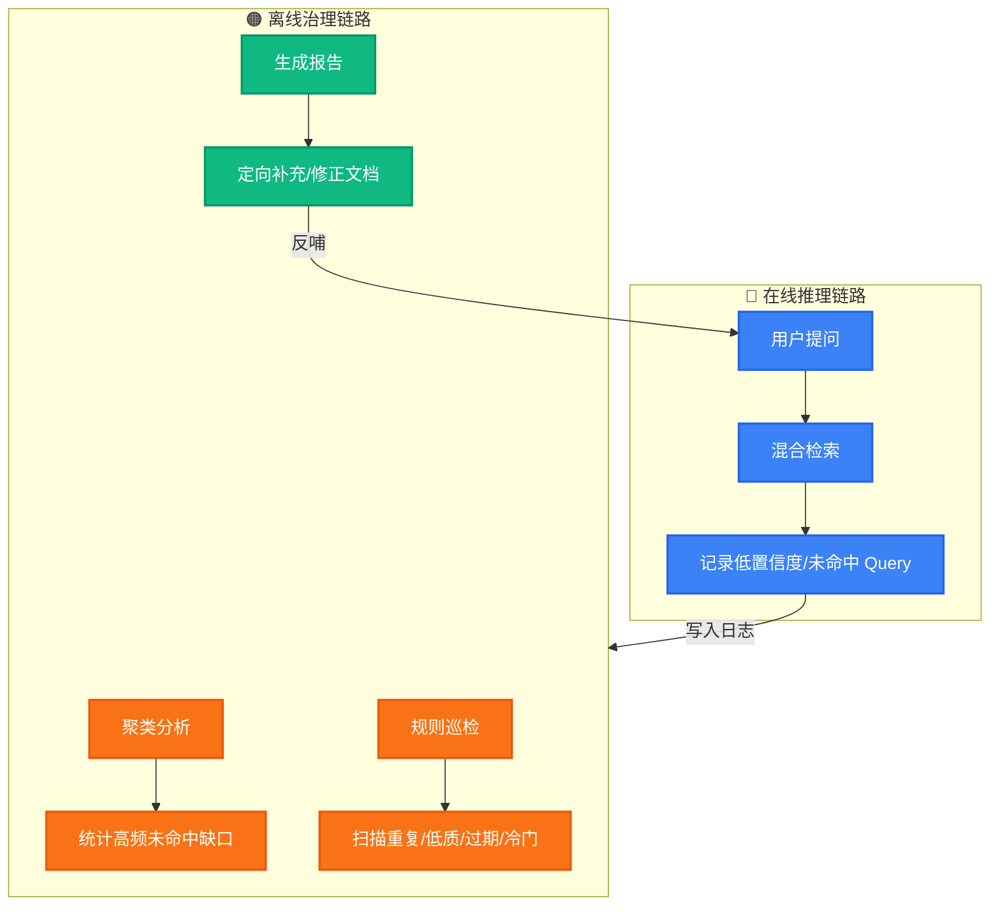

<div align="center">

# Agentic RAG 智能问答与知识治理平台

**基于 Java (Spring Boot) + Python (FastAPI) 双语言架构的 RAG 知识库系统，集成 Multi-Agent 协同、长短期记忆、全链路 Trace 审计与知识库巡检治理模块。**

[](https://openjdk.org/)
[](https://spring.io/projects/spring-boot)
[](https://python.org/)
[](https://fastapi.tiangolo.com/)
[](https://milvus.io/)
[](https://redis.io/)
[](https://mysql.com/)
[](LICENSE)

</div>

***

## 📖 项目简介

本项目是一个基于 **Java 后端 + Python AI 服务** 的 RAG 知识库系统。系统涵盖在线多智能体协同问答与离线知识库治理两大核心链路：在线侧通过混合检索、DAG 任务编排、多级记忆与语义缓存提升多跳问答准确度与响应速度；离线侧通过 Trace 审计日志采集未命中查询，定期巡检文档质量，形成知识补全与治理闭环。

### 核心功能模块

* **混合检索与重排序**：采用语义感知父子分块，结合 Milvus BM25 稀疏检索与 HNSW 稠密向量双路召回，通过 RRF 算法融合并使用 Cross-Encoder 进行语义重排序。
* **Multi-Agent 协同与自评**：面向多跳推理任务，基于 DAG 拓扑排序并行调度 Sub-Agent，通过 EventBus 共享上下文；Sub-Agent 结合 ReAct 范式进行检索充分性自评与改写重试。
* **三级记忆与二级语义缓存**：构建“工作记忆 → 长期记忆 (semantic/episodic/procedural) → 用户画像”三级体系，自动触发摘要沉淀；结合 Caffeine + Redis 二级缓存与 Milvus 语义相似度匹配加速高频请求。
* **全链路 Trace 审计**：在路由分发、LLM 调用、工具执行等节点统一埋点，跨 Java/Python 收集 I/O、耗时与 Token 消耗。
* **知识库离线治理**：基于问答与未命中日志聚类高频未覆盖 Query，巡检重复、低质、过期及冷门文档，反哺知识库维护。

***

## 🏗️ 系统架构设计



***

## ⚙️ 核心模块实现细节

### 1. 父子分块与混合检索重排

针对长文档切分造成的上下文碎片化问题，采用父子分块结构：
* **子 Chunk**（细粒度语义片段）用于向量索引与检索召回；
* **父 Chunk**（大范围上下文）在命中后回溯拼接，提供给 LLM 完整上下文；
* 检索阶段组合 Milvus BM25 稀疏关键词检索与 HNSW 向量检索，经 RRF 融合后通过 Cross-Encoder 进行重排序。



### 2. DAG Multi-Agent 协同与自评

针对复合问题与多跳查询，通过 DAG 拓扑排序对子任务进行并行依赖调度：
* 依赖前置结果的任务在就绪后触发，独立子任务并行执行；
* 各 Agent 通过 EventBus 共享中间推理状态；
* Sub-Agent 执行检索后评估召回内容充分性，若不足则触发改写重试。



### 3. 多级记忆与二级语义缓存

* **三级记忆划分**：
    * 工作记忆：维护单次会话上下文；
    * 长期记忆：分为事实类 (semantic)、事件类 (episodic) 和操作规程类 (procedural)，结合异步 LLM 摘要进行压缩归档；
    * 用户画像：记录常用业务偏好。
* **二级语义缓存**：
    * 本地使用 Caffeine 支撑微秒级高频读取，分布式侧使用 Redis；
    * 结合 Milvus 进行相似 Query 语义匹配，命中时直接返回历史结果并自动延长热点 Key TTL。

### 4. 全链路 Trace 审计

在 Java 业务侧与 Python AI 侧统一透传链路标识（TraceId），在路由分发、LLM 调用、向量检索、工具执行等环节记录执行耗时、输入输出载荷与 Token 消耗，支持问答全过程的透明回放与异常排查。

### 5. 知识库离线治理闭环



***

## 🛠️ 技术栈清单

| 分层 / 模块 | 技术选型 | 用途说明 |
| :--- | :--- | :--- |
| **后端业务中台** | `Java 17` / `Spring Boot 3.2` / `MyBatis-Plus` | 接口鉴权、业务逻辑处理、数据持久化 |
| **流式交互** | `Spring WebFlux` (SSE) | 服务端事件流式推送问答结果 |
| **AI 服务** | `Python 3.10+` / `FastAPI` / `Pydantic` | 异步 AI 任务调度与模型接口封装 |
| **向量数据库** | `Milvus 2.4+` | BM25 稀疏检索、HNSW 稠密检索与语义缓存索引 |
| **关系型数据库** | `MySQL 8.0` | 用户数据、文档元数据与 Trace 日志持久化 |
| **多级缓存** | `Caffeine` / `Redis 7.0` | 本地缓存与分布式会话/缓存 |
| **模型与重排** | `DashScope (Qwen-Plus)` / `Cross-Encoder` | 文本生成、向量 Embedding 与结果重排序 |
| **质量评估** | `RAGAS` | Context Precision / Recall / Faithfulness 评测 |

***

## 🚀 快速启动

### 1. 环境准备

确保本地已启动以下服务：
- **MySQL 8.0**（端口 3306）
- **Redis 7.0**（端口 6379）
- **Milvus 2.4+**（端口 19530）

### 2. 初始化数据库

```bash
mysql -u root -p -e "CREATE DATABASE ai_knowledge_db CHARACTER SET utf8mb4 COLLATE utf8mb4_unicode_ci;"
mysql -u root -p ai_knowledge_db < sql/init.sql
```

### 3. 启动 Python AI 服务（端口 8000）

```bash
cd python-service
pip install -r requirements.txt

# 配置环境变量（复制并编辑 .env）
cp .env.example .env
# 编辑 .env，填入 DASHSCOPE_API_KEY 等配置

python main.py
```

### 4. 启动 Java 后端（端口 8080）

```bash
# 编辑 src/main/resources/application.yml 配置数据库连接
mvn clean package -DskipTests
java -jar target/ai-knowledge-system-*.jar
```

### 5. 启动前端（端口 3000）

```bash
cd frontend
npm install
npm run dev
```

### 访问地址

- **用户端**：`http://localhost:3000/login`（手机验证码登录，模拟模式验证码在控制台）
- **管理端**：`http://localhost:3000/admin/login`（`admin` / `admin123`）

***

## 📂 项目目录结构

```text
.
├── backend-service/                # Java 后端工程 (Spring Boot)
│   ├── src/main/java/com/rag/
│   │   ├── controller/             # REST 接口与 SSE 控制器
│   │   ├── service/                # 业务逻辑与巡检任务服务
│   │   ├── cache/                  # Caffeine + Redis 缓存实现
│   │   └── trace/                  # 跨语言 Trace 拦截与存储
│   └── src/main/resources/         # 配置文件与 SQL 映射文件
├── ai-service/                     # Python AI 服务 (FastAPI)
│   ├── core/
│   │   ├── chunking/               # 父子切分实现
│   │   ├── retrieval/              # Milvus 混合检索与 Rerank
│   │   └── evaluation/             # RAGAS 评估脚本
│   ├── agents/
│   │   ├── orchestrator.py         # DAG 拓扑调度编排
│   │   ├── event_bus.py            # 上下文共享事件总线
│   │   └── sub_agents/             # Sub-Agent 业务实现
│   ├── memory/                     # 三级记忆管理模块
│   └── governance/                 # 未命中聚类与知识巡检
├── sql/                            # 数据库初始化 SQL
└── README.md
```

***

## 📄 开源许可证

本项目采用 [MIT License](LICENSE) 授权