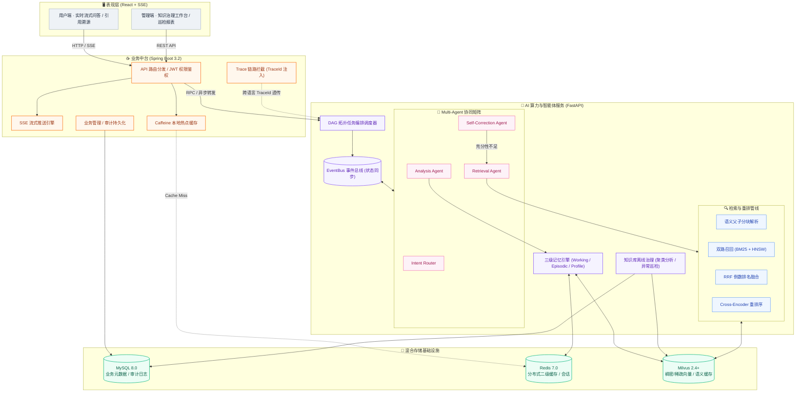
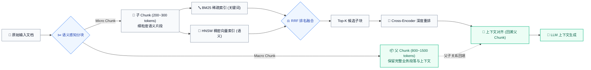
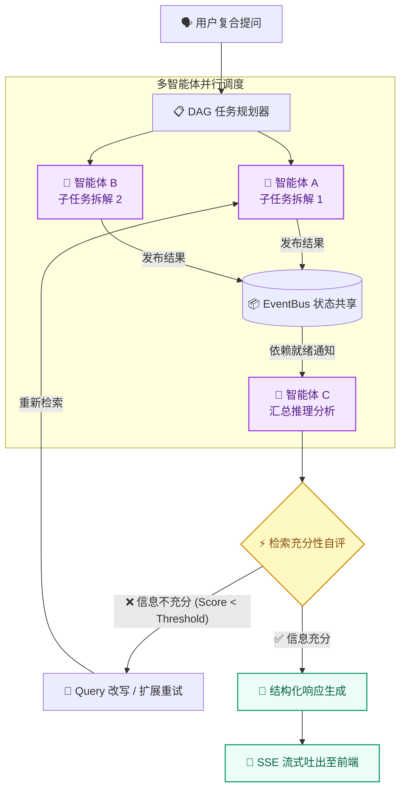
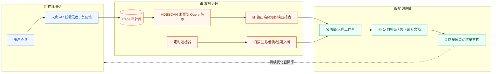

<div align="center">

# ⚡ Agentic RAG 智能问答与知识治理平台

**基于 Java (Spring Boot) + Python (FastAPI) 双引擎架构的高性能 RAG 系统**  
*集成 Multi-Agent 协同调度 · 混合检索与重排序 · 三级记忆引擎 · 离线知识治理闭环 · 全链路 Trace 审计*

<p align="center">
  
  
  
  
  
  
  
  
</p>

</div>

---

## 📖 项目简介

本项目是一个基于 **Java 后端 + Python AI 服务** 的 RAG 知识库系统。系统涵盖在线多智能体协同问答与离线知识库治理两大核心链路：在线侧通过混合检索、DAG 任务编排、多级记忆与语义缓存提升多跳问答准确度与响应速度；离线侧通过 Trace 审计日志采集未命中查询，定期巡检文档质量，形成知识补全与治理闭环。


### 核心功能模块


* **混合检索与重排序**：采用语义感知父子分块，结合 Milvus BM25 稀疏检索与 HNSW 稠密向量双路召回，通过 RRF 算法融合并使用 Cross-Encoder 进行语义重排序。

* **Multi-Agent 协同与自评**：面向多跳推理任务，基于 DAG 拓扑排序并行调度 Sub-Agent，通过 EventBus 共享上下文；Sub-Agent 结合 ReAct 范式进行检索充分性自评与改写重试。

* **三级记忆与二级语义缓存**：构建“工作记忆 → 长期记忆 (semantic/episodic/procedural) → 用户画像”三级体系，自动触发摘要沉淀；结合 Caffeine + Redis 二级缓存与 Milvus 语义相似度匹配加速高频请求。

* **全链路 Trace 审计**：在路由分发、LLM 调用、工具执行等节点统一埋点，跨 Java/Python 收集 I/O、耗时与 Token 消耗。

* **知识库离线治理**：基于问答与未命中日志聚类高频未覆盖 Query，巡检重复、低质、过期及冷门文档，反哺知识库维护。

---

## 🏗️ 系统整体架构



---

## ⚙️ 核心技术实现

### 1. 混合检索与上下文重构管线

采用“**小切块检索召回，大切块提供上下文**”策略，解决细粒度检索精确度与大模型上下文完整度之间的冲突。



### 2. DAG 驱动的 Multi-Agent 协同与自评回路

对于复合型复杂多跳提问，系统通过拓扑排序自动分解任务依赖，支持并行分支与检索质量自愈。



### 3. 三级记忆与二级语义缓存机制

* **三级记忆架构**：
  * **工作记忆 (Working Memory)**：基于当前会话上下文窗口，管理轮次对话。
  * **长期记忆 (Long-term Memory)**：分类沉淀为 `Semantic`（事实知识）、`Episodic`（交互事件）与 `Procedural`（操作规程），由后台异步 LLM 自动提取并向量化入库。
  * **用户画像 (User Profile)**：维护业务偏好与常用领域标签，个性化调整 Prompt 权重。
* **二级语义缓存加速**：
  * **L1 本地缓存**：`Caffeine` 提供微秒级单机热点拦截。
  * **L2 分布式语义缓存**：`Redis + Milvus` 协同。输入 Query 首先进入 Milvus 执行向量余弦相似度匹配，若高于预设阈值（如 `0.95`）则判定语义命中，直接返回缓存结果并延长热点 Key 的 TTL。

### 4. 闭环知识库离线治理体系



---

## 🛠️ 技术栈清单

| 层次 / 模块 | 技术选型 | 核心作用说明 |
| :--- | :--- | :--- |
| **业务中台** | `Java 17` / `Spring Boot 3.2` / `MyBatis-Plus` | 核心业务路由、高并发鉴权、审计持久化 |
| **流式通信** | `Spring WebFlux` (SSE) | 生产级 Server-Sent Events 流式响应与心跳保活 |
| **AI 引擎** | `Python 3.10+` / `FastAPI` / `Pydantic` | 异步 AI 服务、DAG 编排、多智能体协同 |
| **向量数据库** | `Milvus 2.4+` | BM25 稀疏检索、HNSW 稠密检索与语义缓存索引 |
| **持久化存储** | `MySQL 8.0` | 业务元数据、Trace 全链路审计日志持久化 |
| **多级缓存** | `Caffeine` + `Redis 7.0` | 本地微秒级缓存 + 分布式高可用会话与缓存 |
| **大模型 / 向量** | `DashScope (Qwen-Plus)` / `Cross-Encoder` | 复杂多跳推理生成、高维文本向量化与精准重排 |
| **质量评估** | `RAGAS` | 针对上下文相关性、忠实度与召回率的自动化评测 |

---

## 🚀 快速启动

### 1. 基础环境依赖

请确保本地或服务器已安装并启动以下中间件：
* **MySQL 8.0**（默认端口 `3306`）
* **Redis 7.0**（默认端口 `6379`）
* **Milvus 2.4+**（默认端口 `19530`）

### 2. 数据库与元数据初始化

```bash
mysql -u root -p -e "CREATE DATABASE ai_knowledge_db CHARACTER SET utf8mb4 COLLATE utf8mb4_unicode_ci;"
mysql -u root -p ai_knowledge_db < sql/init.sql
```

### 3. 启动 Python AI 服务 (Port: 8000)

```bash
cd ai-service
python3 -m venv venv && source venv/bin/activate
pip install -r requirements.txt

# 配置环境变量
cp .env.example .env
# 编辑 .env 文件，填入 DASHSCOPE_API_KEY 与 Milvus/Redis 连接信息

python main.py
```

### 4. 启动 Java 业务中台 (Port: 8080)

```bash
cd backend-service
# 修改 src/main/resources/application.yml 中的数据源配置
mvn clean package -DskipTests
java -jar target/ai-knowledge-system-*.jar
```

### 5. 启动前端交互界面 (Port: 3000)

```bash
cd frontend
npm install
npm run dev
```

### 平台入口

* **用户端对话界面**：`http://localhost:3000/login`（支持手机验证码登录）
* **知识治理管理端**：`http://localhost:3000/admin/login`（默认账号：`admin` / `admin123`）

---

## 📂 项目工程结构

```text
.
├── backend-service/                # Java 业务中台工程 (Spring Boot)
│   ├── src/main/java/com/rag/
│   │   ├── controller/             # RESTful API 与 SSE 流式控制器
│   │   ├── service/                # 业务逻辑与定时巡检任务
│   │   ├── cache/                  # Caffeine + Redis 多级缓存封装
│   │   └── trace/                  # 跨语言 TraceId 拦截与审计存储
│   └── src/main/resources/         # 基础配置与 MyBatis Mapper XML
├── ai-service/                     # Python AI 核心服务 (FastAPI)
│   ├── core/
│   │   ├── chunking/               # 语义感知父子分块实现
│   │   ├── retrieval/              # 混合检索 (BM25+HNSW) 与重排
│   │   └── evaluation/             # RAGAS 指标自动化评估
│   ├── agents/
│   │   ├── orchestrator.py         # DAG 拓扑执行引擎
│   │   ├── event_bus.py            # Agent 间状态共享总线
│   │   └── sub_agents/             # 细分 Agent 逻辑实现
│   ├── memory/                     # 三级记忆管理 (Working/Episodic/Profile)
│   └── governance/                 # Query 聚类分析与知识巡检
├── sql/                            # 数据库建表与初始化脚本
└── README.md
```

---

## 📄 开源许可证

本项目基于 [MIT License](LICENSE) 协议开源