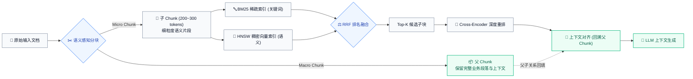
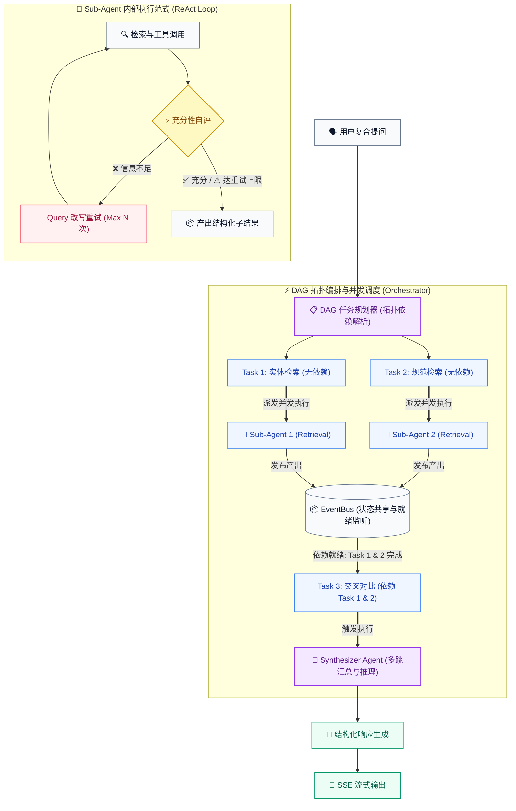
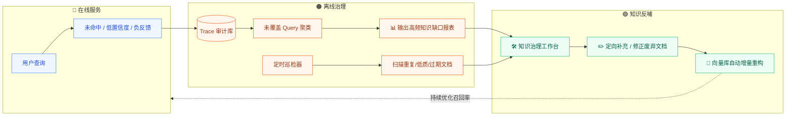

<div align="center">

# Agentic RAG 智能问答与知识治理平台

**基于 Java (Spring Boot) + Python (FastAPI) 双引擎架构的高性能 RAG 系统**  
*集成 Multi-Agent 协同调度 · 混合检索与重排序 · 三级记忆引擎 · 离线知识治理闭环 · 全链路 Trace 审计*

<p align="center">
  
  
  
  
  
  
  
  
</p>

</div>

---

## 📖 项目简介

本项目是一个基于 **Java 后端 + Python AI 服务** 的 RAG 知识库系统。系统涵盖在线多智能体协同问答与离线知识库治理两大核心链路：在线侧通过混合检索、DAG 任务编排、多级记忆与语义缓存提升多跳问答准确度与响应速度；离线侧通过 Trace 审计日志采集未命中查询，定期巡检文档质量，形成知识补全与治理闭环。


### 核心功能模块


* **混合检索与重排序**：采用语义感知父子分块，结合 Milvus BM25 稀疏检索与 HNSW 稠密向量双路召回，通过 RRF 算法融合并使用 Cross-Encoder 进行语义重排序。

* **Multi-Agent 协同与自评**：面向多跳推理任务，基于 DAG 拓扑排序并行调度 Sub-Agent，通过 EventBus 共享上下文；Sub-Agent 结合 ReAct 范式进行检索充分性自评与改写重试。

* **三级记忆与三级语义缓存**：构建”工作记忆 → 长期记忆 (semantic/episodic/procedural) → 用户画像”三级体系，自动触发摘要沉淀；结合 Caffeine + Redis 精确匹配 + Milvus 语义相似度三级缓存加速高频请求。

* **全链路 Trace 审计**：在路由分发、LLM 调用、工具执行等节点统一埋点，跨 Java/Python 收集 I/O、耗时与 Token 消耗。

* **知识库离线治理**：基于问答与未命中日志聚类高频未覆盖 Query，巡检重复、低质、过期及冷门文档，反哺知识库维护。

---

## 🏗️ 系统整体架构

```mermaid
flowchart LR
    %% ================= 全局样式定义 =================
    classDef clientStyle fill:#EEF2F6,stroke:#64748B,stroke-width:1.5px,color:#0F172A;
    classDef javaStyle fill:#FFF7ED,stroke:#EA580C,stroke-width:1.5px,color:#7C2D12;
    classDef agentStyle fill:#FDF2F8,stroke:#DB2777,stroke-width:1.5px,color:#831843;
    classDef pipeStyle fill:#EFF6FF,stroke:#2563EB,stroke-width:1.5px,color:#1E3A8A;
    classDef memStyle fill:#F5F3FF,stroke:#7C3AED,stroke-width:1.5px,color:#4C1D95;
    classDef storeStyle fill:#ECFDF5,stroke:#059669,stroke-width:1.5px,color:#064E3B;

    %% ================= 1. 表现层 =================
    subgraph Client ["🖥️ 表现层 (React 18 + Vite · Port 3000)"]
        direction TB
        UI_User["👤 <b>用户端</b><br/>• SSE 流式问答响应<br/>• 知识引用溯源<br/>• 用户反馈"]
        UI_Admin["🛠️ <b>管理端</b><br/>• 运营分析仪表盘<br/>• 知识库巡检<br/>• 全链路 Trace 审计"]
    end
    class UI_User,UI_Admin clientStyle

    %% ================= 2. 业务中台 =================
    subgraph Gateway ["☕ 业务中台 (Spring Boot 3.4 · Port 8080)"]
        direction TB
        JWT["🔐 <b>统一鉴权网关</b> (Phone + Password JWT)"]
        
        subgraph MidCore ["中台核心驱动"]
            direction TB
            SSE["📡 <b>SSE 流式代理</b> (WebClient 异步桥接)"]
            Trace["⏱️ <b>Trace 采集器</b> (TraceId 全链路注入)"]
            Biz["💼 <b>业务管理</b> (持久化 / 定时巡检 / 报表)"]
        end

        subgraph Cache ["🧊 <b>三级缓存加速链</b>"]
            direction LR
            L1["L1 Caffeine<br/>本地微秒级"] -->|Miss| L2["L2 Redis<br/>精确匹配"] -->|Miss| L3["L3 Milvus<br/>cosine ≥ 0.90"]
        end
    end
    class JWT,SSE,Trace,Biz,L1,L2,L3 javaStyle

    %% ================= 3. AI 智能体与核心引擎 =================
    subgraph AI ["🐍 AI 智能体框架 (FastAPI · Port 8000)"]
        direction TB

        %% 智能体编排
        subgraph Agents ["🤖 多 Agent 协同系统"]
            direction TB
            Router["🧭 <b>RouterAgent</b> (意图分类)"]
            
            subgraph Workers ["分流执行"]
                direction TB
                ChitChat["💬 <b>ChitChatAgent</b><br/>规则过滤 + LLM 自然回复"]
                KQA["📚 <b>KnowledgeQAAgent</b><br/>上下文组装 → 多 Agent 编排"]
                AdminCopilot["📊 <b>AdminCopilotAgent</b><br/>运营数据分析 / 知识巡检"]
            end
            
            MultiAgent["🔀 <b>MultiAgentOrchestrator</b> (DAG 拓扑并行调度)"]
            ReAct["⚙️ <b>ReActAgent Workers</b> (Observe → Think → Act)"]
            EventBus[("📢 <b>EventBus 黑板</b> (状态共享 + Pub/Sub)")]

            Router --> ChitChat & KQA & AdminCopilot
            KQA --> MultiAgent --> ReAct
            ReAct -.->|"事件发布/订阅"| EventBus
        end
        class Router,ChitChat,KQA,AdminCopilot,MultiAgent,ReAct,EventBus agentStyle

        %% 检索管线与记忆引擎并列
        subgraph Engines ["⚡ 双核心引擎"]
            direction LR
            subgraph PipeEngine ["🔍 混合检索重排管线"]
                direction LR
                P1["1. <b>查询预处理</b>: Query 改写 / 父子分块"]
                P2["2. <b>双路召回</b>: HNSW 稠密向量 + BM25 稀疏检索"]
                P3["3. <b>精细重排</b>: RRF 排名融合 + Cross-Encoder"]
                P4["4. <b>后置处理</b>: 引用整合 · 回溯父 Chunk"]
                P1 --> P2 --> P3 --> P4
            end

            subgraph MemEngine ["🧠 三级记忆与离线治理"]
                direction TB
                M1["• <b>工作记忆</b> (Redis · 会话 TTL 24h)"]
                M2["• <b>长期记忆</b> (Milvus · 语义/情景/程序<br/>&nbsp;&nbsp;三维打分: α·语义 + β·时间 + γ·重要性)"]
                M3["• <b>用户画像</b> (MySQL · 偏好标签加权合并)"]
                M4["• <b>离线治理</b> (自动聚类 + 知识巡检)"]
            end
        end
        class P1,P2,P3,P4 pipeStyle
        class M1,M2,M3,M4 memStyle

        ReAct ==>|"调用检索"| PipeEngine
        KQA -.->|"上下文读取"| MemEngine
    end

    %% ================= 4. 存储基础设施 =================
    subgraph Storage ["💾 混合存储基础设施"]
        direction TB
        DB_Redis[("<b>Redis 7.0</b><br/>• 精确缓存<br/>• 会话工作记忆 (TTL 24h)<br/>• 分布式执行锁")]
        DB_Milvus[("<b>Milvus 2.4+ (3 Collections)</b><br/>• 语义向量缓存<br/>• 知识库稠密向量 (子 Chunk)<br/>• 长期记忆向量索引")]
        DB_MySQL[("<b>MySQL 8.0</b><br/>• 业务元数据 / Trace 日志<br/>• 知识库 / 用户画像<br/>• 未命中问题日志")]
    end
    class DB_Redis,DB_Milvus,DB_MySQL storeStyle

    %% ================= 主干跨层数据流 (极简单向连接) =================
    Client ==>|"HTTP / SSE 交互 (JWT 鉴权)"| JWT
    JWT --> SSE & Biz
    SSE -.-> Cache
    
    SSE ==>|"<br/>WebClient 代理 + TraceId 透传"| Router
    
    Gateway -.->|"业务持久化 & 缓存读写"| Storage
    Engines ==>|"向量检索 / 记忆读写 / 治理反哺"| Storage
```



---

## ⚙️ 核心技术实现

### 1. 混合检索与上下文重构管线

采用“**小切块检索召回，大切块提供上下文**”策略，解决细粒度检索精确度与大模型上下文完整度之间的冲突。



### 2. DAG 驱动的 Multi-Agent 协同与自评回路

对于复合型复杂多跳提问，系统通过拓扑排序自动分解任务依赖，支持并行分支与检索质量自愈。



### 3. 三级记忆与二级语义缓存机制

* **三级记忆架构**：
  * **工作记忆 (Working Memory)**：基于当前会话上下文窗口，管理轮次对话。
  * **长期记忆 (Long-term Memory)**：分类沉淀为 `Semantic`（事实知识）、`Episodic`（交互事件）与 `Procedural`（操作规程），由后台异步 LLM 自动提取并向量化入库。
  * **用户画像 (User Profile)**：维护业务偏好与常用领域标签，个性化调整 Prompt 权重。
* **二级语义缓存加速**：
  * **L1 本地缓存**：`Caffeine` 提供微秒级单机热点拦截。
  * **L2 分布式语义缓存**：`Redis + Milvus` 协同。输入 Query 首先进入 Milvus 执行向量余弦相似度匹配，若高于预设阈值（`0.90`）则判定语义命中，直接返回缓存结果并延长热点 Key 的 TTL。

### 4. 闭环知识库离线治理体系



---

## 🛠️ 技术栈清单

| 层次 / 模块 | 技术选型 | 核心作用说明 |
| :--- | :--- | :--- |
| **业务中台** | `Java 17` / `Spring Boot 3.4` / `MyBatis-Plus` | 核心业务路由、高并发鉴权、审计持久化 |
| **流式通信** | `Spring WebFlux` (SSE) | 生产级 Server-Sent Events 流式响应 |
| **AI 引擎** | `Python 3.10+` / `FastAPI` / `Pydantic` | 异步 AI 服务、DAG 编排、多智能体协同 |
| **向量数据库** | `Milvus 2.4+` | BM25 稀疏检索、HNSW 稠密检索与语义缓存索引 |
| **持久化存储** | `MySQL 8.0` | 业务元数据、Trace 全链路审计日志持久化 |
| **多级缓存** | `Caffeine` + `Redis 7.0` | 本地微秒级缓存 + 分布式高可用会话与缓存 |
| **大模型 / 向量** | `DashScope` / `Cross-Encoder` | 复杂多跳推理生成、高维文本向量化与精准重排 |
| **质量评估** | `RAGAS` | 针对上下文相关性、忠实度与召回率的自动化评测 |

---

## 🚀 快速启动

### 1. 基础环境依赖

请确保本地或服务器已安装并启动以下中间件：
* **MySQL 8.0**（默认端口 `3306`）
* **Redis 7.0**（默认端口 `6379`）
* **Milvus 2.4+**（默认端口 `19530`）

### 2. 数据库与元数据初始化

```bash
mysql -u root -p -e "CREATE DATABASE ai_knowledge_db CHARACTER SET utf8mb4 COLLATE utf8mb4_unicode_ci;"
mysql -u root -p ai_knowledge_db < sql/init.sql
```

### 3. 启动 Python AI 服务 (Port: 8000)

```bash
cd python-service
python3 -m venv venv && source venv/bin/activate
pip install -r requirements.txt

# 配置环境变量
cp .env.example .env
# 编辑 .env 文件，填入 DASHSCOPE_API_KEY 与 Milvus/Redis 连接信息

python main.py
```

### 4. 启动 Java 业务中台 (Port: 8080)

```bash
# 修改 src/main/resources/application.yml 中的数据源配置
mvn clean package -DskipTests
java -jar target/ai-knowledge-system-*.jar
```

### 5. 启动前端交互界面 (Port: 3000)

```bash
cd frontend
npm install
npm run dev
```

### 平台入口

* **用户端对话界面**：`http://localhost:3000/login`（支持手机验证码登录）
* **知识治理管理端**：`http://localhost:3000/admin/login`（默认账号：`admin` / `admin123`）

---

## 📂 项目工程结构

```text
.
├── src/main/java/com/demo/aiknowledge/   # Java 业务中台 (Spring Boot 3.4)
│   ├── controller/             # RESTful API 与 SSE 流式控制器
│   ├── service/                # 业务逻辑与定时巡检任务
│   ├── config/                 # Security / Cache / CORS 配置
│   ├── entity/                 # MyBatis-Plus 数据库实体
│   └── mapper/                 # MyBatis-Plus Mapper 接口
├── python-service/                     # Python AI 服务 (FastAPI)
│   ├── agent/                  # RouterAgent / ReActAgent / MemoryAgent
│   ├── engine/                 # DAG 编排器 / EventBus / 状态管理
│   ├── workflow/               # 知识问答 / 闲聊 / 管理助手 / 推理
│   ├── service/                # 检索 / 重排 / 父子分块 / 语义缓存 / 巡检
│   ├── tools/                  # Tool Registry 工具体系
│   ├── memory/                 # 三级记忆管理 (语义/情景/程序)
│   ├── intent/                 # 意图分类器 (LLM + 关键词 Fallback)
│   ├── core/                   # LLM / Milvus / MySQL / Redis 基础设施
│   └── eval/                   # RAGAS 评测框架
├── frontend/                   # React 18 + Vite 前端
│   └── src/
│       ├── api/                # Axios API 封装 (用户端/管理端/仪表盘)
│       └── pages/              # 用户端 + 管理端页面
├── sql/                        # MySQL 初始化脚本
└── pom.xml                     # Maven 配置
```

---

## 📄 开源许可证

本项目基于 [MIT License](LICENSE) 协议开源